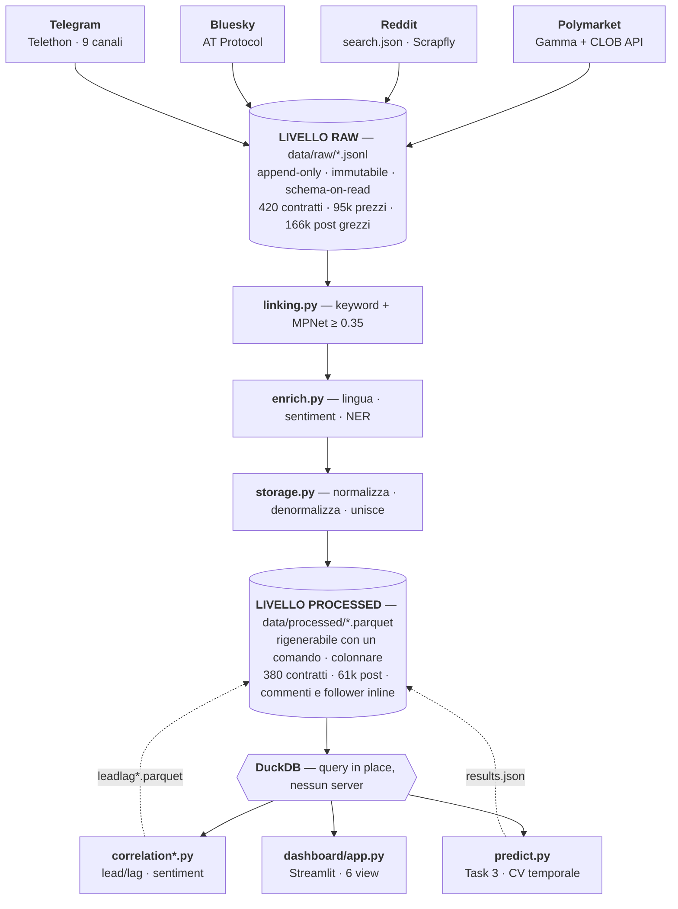
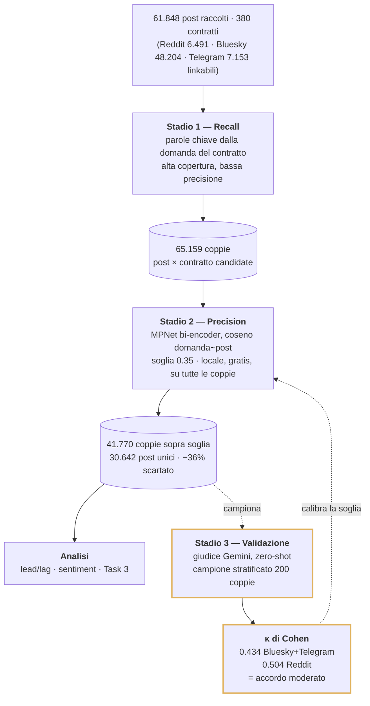
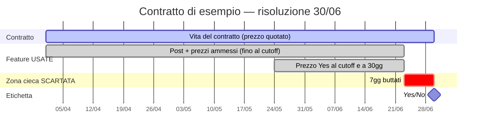

## Social Media Signals and Prediction Market Outcomes

### A Data-Driven Study on Polymarket — Relazione Tecnica

**Big Data Engineering 2025/2026 — Track 2 · Prof. Vincenzo Moscato**

Autore: Massimo Marrone · Svolto individualmente

**Codice:** [github.com/MassimoMarrone/bigdata-polymarket](https://github.com/MassimoMarrone/bigdata-polymarket) ·
**Dashboard live e documentazione:** [polymarket.massimomarrone.dev](https://polymarket.massimomarrone.dev)

---

### 1. Introduzione e obiettivo

I *prediction market* come Polymarket aggregano l'intelligenza collettiva sul verificarsi di eventi futuri: il prezzo di un contratto, tra 0 e 1, si legge come la probabilità che il mercato assegna a un esito. Questo progetto studia empiricamente la relazione tra il **discorso sui social media** e gli **esiti dei contratti Polymarket**, su tre domini (politica, finanza, sport).

**Domanda di ricerca.** Il discorso social *anticipa* i movimenti del mercato (segnale predittivo), oppure li *commenta* dopo che sono avvenuti (segnale reattivo)?

**Anticipazione del risultato.** Nessun anticipo misurabile del discorso social sul mercato, a granularità giornaliera: volume social e movimenti di prezzo **co-variano lo stesso giorno** (picco a offset 0, r=0,14, profilo simmetrico — §7.3), e nel task predittivo le feature social non aggiungono nulla al prezzo (AUC 0,553 contro 0,966 — §8). La lettura più semplice, coerente con la calibrazione di §7.1: il mercato ha già incorporato il discorso.

**Scope.** Task 1 (ingestion), Task 2 (dashboard analitica) e Task 3 opzionale (outcome prediction, §8) completi.

---

### 2. Le fonti dati e una scelta obbligata sulle piattaforme

La traccia indica tre piattaforme social: **Reddit, X (Twitter), Telegram**. Il dataset finale ne
usa **tre — Reddit, Telegram e Bluesky** — dove Bluesky sostituisce X. Ogni scelta di accesso è
stata verificata empiricamente, non assunta.

**Reddit — raccolto via scraping (metodo indicato dal corso).** L'accesso a Reddit non è banale e
va documentato con onestà. L'API ufficiale non è più disponibile in self-service: la registrazione
di un'app *script* su `reddit.com/prefs/apps` non si completa (dopo le restrizioni di fine 2025
l'account viene reindirizzato al modulo di approvazione della *Responsible Builder Policy*), e
l'endpoint pubblico `.json` risponde **HTTP 403** a ogni richiesta da script, anche con user-agent
di browser (blocco anti-bot alla prima chiamata, non un rate-limit — verificato sui log). La via
percorribile, indicata dal docente, è lo **scraping tramite proxy residenziale (Scrapfly)**, che
supera il 403. Con questo metodo si è raccolto per keyword della domanda del contratto, nella
finestra creazione→risoluzione: **6.491 post su 340/380 contratti (89% di copertura)**, la più
alta delle tre piattaforme, con un campione di commenti (17.969) e i follower/karma degli autori.
Due numeri diversi, entrambi veri, che conviene tenere distinti: 89% è la copertura *raccolta*
(contratti con almeno un post trovato); dopo il filtro semantico di §4 restano **328/380 contratti
(86%) e 4.592 post** — è questa la copertura che alimenta l'analisi, ed è il numero che la
dashboard mostra.

**X/Twitter — genuinamente inaccessibile, sostituito con Bluesky.** X è l'unica piattaforma
davvero irraggiungibile, e su tre fronti indipendenti: (1) l'API a pagamento parte da **~$42.000/mese**
(full-archive search *Enterprise-only*, verificato 2026); (2) la ricerca web è **dietro login dal
2023** — un probe di scraping sulla pagina di ricerca restituisce **0 tweet** e la pagina di
fallback "JavaScript is not available", perché i risultati caricano via GraphQL autenticato; (3)
gli scraper disponibili espongono solo *tweet-da-URL* e *profilo* (metadati, nessun timeline di
post), quindi non c'è modo di recuperare tweet a tema per il linking. Al suo posto si usa
**Bluesky**: stessa nicchia (discorso testuale short-form in tempo reale), API pubblica
(`api.bsky.app`) con ricerca full-text storica. Un probe su 12 contratti ha dato 10/12 con ≥5 post
pertinenti (media 65 post/contratto) prima di impegnarsi sull'intero dataset.

**Telegram — API aperta.** Storia completa di 9 canali pubblici (news broadcaster), linkata
offline (§3.3).

Il risultato è uno studio a **tre piattaforme** che copre l'enum della traccia (reddit ✓,
telegram ✓) più Bluesky come sostituto motivato dell'unica genuinamente inaccessibile. E il
confronto cross-platform (Task 2.4) ne esce arricchito: le tre hanno specializzazioni di dominio
diverse e complementari (§7.2).

---

### 3. Task 1 — La pipeline di ingestione

#### 3.1 Architettura a due livelli

La pipeline segue un approccio **ELT** (Extract-Load-Transform), non ETL:

- **Livello raw** (`data/raw/*.jsonl`) — dati grezzi, append-only, immutabili, uno schema per
  fonte. È un data lake in miniatura: **schema-on-read**, i dati sono salvati nel formato nativo e
  interpretati solo alla lettura. Assorbe l'eterogeneità tra piattaforme e sopravvive a un
  collector interrotto senza corruzione.
- **Livello processed** (`data/processed/*.parquet`) — dati normalizzati e uniti, rigenerabili da
  zero dal livello raw con un comando. È il livello analitico.

**Figura 1 — architettura end-to-end.** La freccia che conta è quella che *non* c'è: nessun
collector scrive mai nel livello processed, e nessuna analisi legge mai dal raw. Il livello
processed è interamente ricostruibile con `python -m pipeline.storage`; il raw, invece, è l'unica
cosa che non si può rigenerare (le API cambiano, i post spariscono) ed è per questo append-only.



#### 3.2 Raccolta Polymarket

Contratti risolti e serie storiche di prezzo dalla Gamma API e dalla CLOB API. **420 contratti** risolti raccolti (≥130 per dominio); un filtro di qualità a valle (≥10 snapshot di prezzo — un contratto con 2 punti non può sostenere un'analisi lead/lag) ne promuove **380 al livello analitico** (130 finance / 127 politics / 123 sports — il minimo di 100 per dominio resta ampiamente rispettato), con **95.094 snapshot** di prezzo giornalieri.

Un campo dello schema della traccia manca, e va detto: il **volume per singolo snapshot**. L'endpoint `prices-history` della CLOB restituisce solo `t` (timestamp) e `p` (prezzo) — il volume per punto non è esposto da nessun endpoint pubblico. La traccia lo chiede "*where available*", e non lo è: resta il **volume cumulato del contratto**, raccolto dalla Gamma API e presente in `contracts.parquet` (usato per il campionamento in §3.2 e per l'ordinamento nella dashboard). Tutti gli altri campi dello schema di Sezione 2 sono presenti: 9/9 sui contratti, 21/21 sui post.

Una scelta di campionamento si è rivelata critica. Ordinando i mercati per volume di scambi, i primi N appartenevano a pochissimi *eventi*: un evento Polymarket contiene decine di *mercati* quasi identici (37 mercati "chi nominerà Trump alla Fed?" — uno per candidato; 39 mercati sul prezzo del petrolio WTI — uno per soglia). Il primo campione aveva 356 contratti ma **solo 15 argomenti reali**, il che avrebbe reso impossibile il linking (mercati diversi generano le stesse parole chiave) e statisticamente vuota l'analisi di correlazione. Si è imposto un **tetto di 3 mercati per evento**, portando la diversità tematica da 15 a **129 eventi distinti**.

#### 3.3 Raccolta social

- **Reddit** — ricerca per parole chiave della domanda del contratto (`search.json` via proxy
  Scrapfly), ristretta alla finestra creazione→risoluzione. La ricerca restituisce già il testo del
  post (titolo + selftext), quindi una richiesta per contratto rende ~100 post. **6.491 post, 89%
  di copertura**, più un campione di **17.969 commenti** (thread dei top post per engagement) e i
  follower/karma di 2.966 autori (seconda passata su `/user/about.json`).
- **Bluesky** — ricerca per parole chiave estratte dalla domanda del contratto, ristretta alla
  finestra di vita del contratto, con paginazione autenticata (app password) e un fallback che
  accorcia la query quando è troppo restrittiva. **48.204 post, 97% dei contratti** (90% dopo il
  filtro semantico).
- **Telegram** — si è scaricata la **storia completa** di 9 canali pubblici (news broadcaster)
  nella finestra temporale (111.122 messaggi) e li si è linkati offline: ne restano **7.153
  messaggi su 48% dei contratti** (40% dopo il filtro). È la piattaforma più sparsa: i canali
  news coprono ciò di cui *loro* parlano, non i nostri contratti.

Su tutte e tre le piattaforme il *linking* usa lo **stesso metodo** (keyword → filtro semantico):
è ciò che rende interpretabile il confronto cross-platform — ogni differenza osservata è una
proprietà delle piattaforme, non del metodo.

Lo schema della traccia chiede anche un *campione di reply/commenti* per post e i *follower*
dell'autore "where available". La search di Bluesky non restituisce nessuno dei due, quindi una
**seconda passata mirata** (`bluesky_extra.py`) li ha raccolti sui post mantenuti dal filtro
semantico (**4.565 commenti**, **10.527 profili autore**); la stessa logica vale per Reddit
(commenti + karma). Per Telegram l'equivalente non esiste — i canali broadcast espongono le
visualizzazioni ma non thread pubblici di commenti né follower per autore (il canale *è* l'autore):
documentato come limite di piattaforma.

#### 3.4 Limiti dichiarati per piattaforma

| | Reddit | Bluesky | Telegram |
|---|---|---|---|
| Copertura contratti (raccolta) | **89%** (domini bilanciati) | 97% (sport quasi completo) | 48% (sport assente) |
| Copertura dopo il filtro semantico | 86% | 90% | 40% |
| Rappresentatività | discussione tematica per subreddit | utenti early-adopter | 9 canali news EN, non gli utenti |
| Campionamento | search per keyword (sort relevance) | search per keyword | storia completa dei canali scelti |
| Engagement | upvote + n. commenti | like/reply/repost | solo visualizzazioni |
| Commenti / follower | campione + karma (follower spesso 0) | campione + follower | non disponibili (broadcast) |
| Sentiment | sui soli post EN | sui soli post EN (88%) | idem |

---

### 4. Il contract-to-post linking (il cuore metodologico)

Collegare un post al contratto giusto è il problema centrale del progetto. Un approccio a sole parole chiave produce falsi positivi **sistematici**: tre contratti sul petrolio WTI (soglie 100$, 105$, 30$ — domande diverse) generano la stessa query e quindi gli stessi post. Correlare il prezzo di un contratto con i post di un altro invaliderebbe tutta l'analisi.

**Pipeline a imbuto in tre stadi:**

1. **Recupero (recall)** — parole chiave, alta copertura, bassa precisione.
2. **Filtro semantico (precision)** — embedding della domanda e del post, similarità coseno, soglia.
   Gira in locale, gratis, applicabile a tutti i post.
3. **Validazione** — un giudice LLM esterno (**Gemini**) valuta in zero-shot la pertinenza su un
   campione stratificato di 200 coppie, per **misurare** la qualità del filtro invece di asserirla.

**Figura 2 — l'imbuto, con i numeri reali.** Il filtro semantico scarta il **36% delle coppie**
recuperate dalle parole chiave: è la misura diretta di quanto un linking a sole keyword sarebbe
stato sbagliato. Si noti che il giudice LLM **non è nella pipeline** — non filtra nulla, è un ramo
laterale che serve solo a misurare il filtro. Metterlo in linea avrebbe significato pagare una
chiamata API per 65k coppie e, soprattutto, non avere più niente con cui validare.



#### 4.1 Calibrazione e ablazione dei modelli

Confrontati due modelli di embedding contro il giudice (κ di Cohen come accordo), sul campione
di validazione consegnato con il dataset (`linking_validation.jsonl`, 200 coppie stratificate,
103 giudicate rilevanti):

| Modello | Soglia | Cohen's κ | Precision | Recall |
|---|---|---|---|---|
| **MPNet** (`all-mpnet-base-v2`) | **0.35 (usata)** | 0.425 | 0.68 | **0.85** |
| MPNet | 0.40 | **0.518** | 0.75 | 0.81 |
| MiniLM (`all-MiniLM-L6-v2`) | 0.45 | 0.440 | 0.73 | 0.72 |

**Tre avvertenze, dichiarate perché un lettore che rifà i conti le troverebbe comunque.**
(1) *Il giudice non è deterministico*: un run precedente su un campione rigenerato dava MPNet
0.434 / MiniLM 0.410 — classifiche diverse fra run. Con n=200 l'errore standard di κ è ≈0.07:
le differenze fra modelli e soglie in tabella sono **dentro il rumore di campionamento del
giudice**, e l'ablazione va letta come "i modelli sono comparabili", non "MPNet vince".
(2) *La soglia è cercata sullo stesso campione su cui si riporta il κ* (stima ottimistica —
stesso caveat già dichiarato per i cross-encoder in §4.2, che si applica identicamente qui).
(3) *Il κ misura l'accordo col giudice LLM, non con una verità umana* — il limite è discusso
sotto. La scelta operativa resta **MPNet @ 0.35** e si fonda sul criterio dichiarato prima
dell'ablazione, che il campione conferma: **recall** (0.85, il migliore in tabella) preferito
a precisione — i falsi positivi si diluiscono nell'aggregazione giornaliera, i falsi negativi
cancellano segnale che non torna.

**La difesa vera è la robustezza a valle, non il κ.** Poiché la soglia è il parametro più
arbitrario del progetto, tutti i risultati principali sono stati rieseguiti a 0.30 / 0.35 / 0.40
(`scripts/sensitivity.py`, output in `sensitivity.json`):

| Soglia | Picco lead/lag | r al picco | AUC prezzo | AUC social | AUC combinato |
|---|---|---|---|---|---|
| 0.30 | offset 0 | 0.134 | 0.965 | 0.498 | 0.925 |
| **0.35** | **offset 0** | **0.140** | **0.966** | **0.553** | **0.942** |
| 0.40 | offset 0 | 0.144 | 0.965 | 0.500 | 0.931 |

Ogni conclusione della relazione è invariante alla soglia: il picco resta a 0, il prezzo domina,
il social non aggiunge nulla, il combinato non supera mai il prezzo.

**Validazione su tutte e tre le piattaforme.** Il κ sopra è misurato su Bluesky+Telegram. Il
linking è stato validato *separatamente* anche su Reddit, con lo stesso giudice, stessa soglia
fissa 0.35 (qui nessuna ricerca di soglia, quindi niente ottimismo da selezione) su un campione
stratificato di 200 coppie: **κ = 0.504**. Il metodo generalizza: non è calibrato su una
piattaforma sola.

**Il limite del giudice.** Il κ misura l'accordo fra due sistemi automatici; l'accuratezza di
Gemini su questo task non è garantita a priori. Per chiudere il cerchio è in corso una
validazione umana: 100 coppie del campione etichettate alla cieca dall'autore, da cui κ
umano↔giudice e κ umano↔filtro. [🔲 risultato da inserire quando l'etichettatura è completa]

#### 4.2 Un esperimento negativo istruttivo

Si è testato se un **cross-encoder** (che legge domanda e post *insieme*) battesse il bi-encoder. Soglia di successo fissata *prima*: κ > 0.55. Cinque modelli testati; **nessuno raggiunge la soglia pre-registrata** (miglior cross-encoder: κ=0.426 — comparabile al bi-encoder, non superiore, e le differenze sono dentro il rumore di campionamento del giudice come per l'ablazione di §4.1). Il risultato è informativo: il difetto non è **architetturale** (bi vs cross-encoding) ma di **obiettivo di addestramento** — questi modelli imparano la *rilevanza topica*, e per un post sul Villarreal e un contratto sul Villarreal la risposta è correttamente "sì"; nessuno sa cercare "il post dice qualcosa su *questa specifica affermazione*".

---

### 5. Preprocessing e arricchimento

- **Rilevamento lingua** — non ci si fida del campo dichiarato; la lingua è rilevata su tutti i
  **45.623 post unici** (tre piattaforme). L'**88%** è in inglese. I post non inglesi restano nel
  dataset (contano per il *volume* di discussione) ma non ricevono sentiment (il modello è inglese):
  dargli un punteggio sarebbe un numero privo di senso.
- **Sentiment** — `cardiffnlp/twitter-roberta-base-sentiment-latest` su **40.527 post inglesi**.
  Distribuzione: 68% neutrale, 16% negativo, 15% positivo. Punteggio con segno, così una media
  giornaliera è direttamente interpretabile.
- **NER** — spaCy su **36.497 post**. Le entità più citate (US, Trump, Iran, Fed, NBA…) confermano
  che il linking aggancia post effettivamente sul tema.
- **Deduplicazione** — un post può legarsi a più contratti legittimamente ("vince il City?" e
  "vince l'Inter?" condividono i post), quindi l'unità è la coppia (post, contratto), non il post.
- **Topic modeling: suggerito dalla traccia, non usato — e il perché va detto.** In questo
  disegno il *topic* di ogni post è già noto per costruzione: è la domanda del contratto a cui il
  linking lo aggancia (129 eventi distinti). Un LDA sui post riscoprirebbe, peggio, una struttura
  che possediamo già esatta; l'asse tematico è coperto dal linking semantico e quello del
  contenuto da sentiment + NER. Sarebbe utile in un disegno diverso (scoperta di temi *non*
  ancorati ai contratti), che non è la domanda di questo progetto.

---

### 6. Task 1.5 — Storage: perché Parquet + DuckDB

La traccia chiede di **motivare** la scelta di storage. Si sono considerate le alternative NoSQL del corso:

- **MongoDB** (documentale) — ottimo per l'eterogeneità di schema e lo streaming; valutato e scartato.
- **Parquet + DuckDB** (colonnare) — **scelto**, perché tutte le query del progetto sono
  **analitiche e colonnari**: prezzo nel tempo, volume di post per giorno, sentiment per dominio.
  I database colonnari sono più efficienti per query analitiche (recupero selettivo di colonne), e
  la ridondanza della denormalizzazione — problematica in scrittura — è ottima quando si fa **solo
  analisi**, perché risparmia le join. DuckDB interroga i Parquet in place, senza server.

**Perché non Spark (misurato, non asserito).** La traccia suggerisce Spark "per dataset *large-scale*". Il nostro è di decine di MB. Si è eseguita la **stessa aggregazione** in DuckDB e PySpark su dati replicati fino a 200×:

| Righe | DuckDB | Spark | Spark più lento |
|---|---|---|---|
| 64.062 (reale) | 0,09s | 9,94s | **106×** |
| 640.620 | 0,11s | 2,38s | 22× |
| 3.203.100 | 0,35s | 2,69s | 7,7× |
| 12.812.400 | 1,03s | 4,88s | 4,8× |

Sui dati reali DuckDB è **~100× più veloce**; il pareggio si estrapola verso ~10⁸ righe, ossia quando i dati non stanno più in una macchina. "Big" è una proprietà del dataset, non un default.

---

### 7. Task 2 — Analisi e risultati

#### 7.1 Descrittiva dei contratti (Task 2.1): il mercato sa in anticipo

Separando i contratti per esito effettivo, il prezzo medio di "Yes" diverge presto:

| Giorni alla risoluzione | Contratti poi vincenti | Contratti poi perdenti |
|---|---|---|
| 120 | 0,49 | 0,09 |
| 30 | 0,59 | 0,09 |
| 7 | 0,70 | 0,06 |

Il mercato prezza correttamente i perdenti (~0,08) fin dall'inizio ed è ben calibrato mesi prima della risoluzione. Ne consegue che i social hanno poco spazio per "anticiparlo", il che affina la domanda di ricerca dai *livelli* ai *movimenti* (§7.3).

#### 7.2 Discorso e confronto cross-platform (Task 2.2 / 2.4): specializzazione complementare

Le tre piattaforme sono specializzate in modo **complementare** — copertura per dominio
(contratti con ≥1 post linkato):

| Piattaforma | Politics (su 127) | Finance (su 130) | Sport (su 123) | Profilo |
|---|---|---|---|---|
| **Reddit** | 117 (92%) | 101 (78%) | 110 (89%) | **bilanciata su tutti i domini** |
| Bluesky | 120 (94%) | 101 (78%) | **122 (99%)** | copre quasi tutto lo sport, discorso utenti |
| Telegram | 70 (55%) | 77 (59%) | **5 (4%)** | politica/finanza, sport praticamente assente |

L'asimmetria è la risposta al Task 2.4: quale piattaforma è più informativa dipende dal dominio,
ed è una proprietà **strutturale**, non un artefatto della raccolta (lo stesso metodo di linking
gira su tutte e tre). Il contrasto forte è sullo sport: Bluesky lo copre quasi tutto (99%),
Telegram praticamente per niente (4%) — 24 volte meno, a parità di metodo. Reddit è la più
equilibrata e in questo senso *riempie i buchi*: dove Telegram è assente, dà comunque l'89%. Su Telegram si erano verificati e scartati 12 canali sportivi alternativi — non esiste
un canale pubblico EN con storico sportivo denso; con Reddit lo sport rientra nel dataset.

#### 7.3 Correlazione segnale-mercato (Task 2.3): sincroni, nessun anticipo misurabile

Correlando la **variazione** giornaliera di prezzo (non il livello) con il volume social (aggregato
sulle tre piattaforme), e sfasando le serie di ±7 giorni, il picco di correlazione è a **offset 0
— lo stesso giorno — con r = 0,14**, su **202 contratti** con dati sufficienti (≥20 giorni, ≥20
post), coerente su tutti e tre i domini (finance 0,134 / politics 0,129 / sports 0,159). Il
profilo **decade simmetricamente** sui due lati (r=0,066 sia a −1 sia a +1), e il contrasto regge
a un intervallo di confidenza: bootstrap sui contratti (2.000 ricampionamenti, l'unità è il
contratto perché i giorni dello stesso contratto sono correlati), **r al picco CI95 [0,107;
0,174]**, differenza picco−fianchi **CI95 [0,050; 0,098]** — esclude lo zero nettamente. La
lettura onesta: social e mercato **reagiscono alla stessa notizia lo stesso giorno**; a
granularità giornaliera non c'è un anticipo misurabile in nessuna delle due direzioni.

**Nota di metodo (e di onestà).** Una prima versione di questa analisi riportava un picco a "lag
+1, i social inseguono". In fase di review finale un **test sintetico** — dati costruiti con un
social che reagisce il giorno dopo — ha rivelato che l'etichettatura del segno era invertita, e
che i timestamp giornalieri dei prezzi (tutti a mezzanotte UTC: il punto del giorno *t* è la
frontiera *t−1/t*) spostano di un giorno l'attribuzione del movimento. Corrette entrambe le
convenzioni (`tests/test_correlation.py` le fissa come regressione), il picco cade a offset 0 con
fianchi simmetrici. La conclusione direzionale è stata quindi **ritirata**: qualunque claim
"anticipa/insegue di un giorno" è sotto la risoluzione temporale di questi dati. Per risolvere la
direzione servirebbero prezzi orari — un'estensione naturale, non un requisito della traccia.

**E la direzione del sentiment?** La traccia chiede esplicitamente se la *direzione* del sentiment sia allineata alla direzione dei movimenti e se *shift rapidi* del sentiment aggregato accompagnino i movimenti significativi. Tre misure, tutte negative:

1. **Lead/lag firmato** — r(ΔP, sentiment medio) è piatto a ogni offset (range ±0,028, estremo
   a +2gg con r=−0,028): nessun profilo coerente.
2. **Allineamento nei giorni di grande movimento** (top decile di |ΔP| per contratto) — il segno
   del sentiment concorda con la direzione del prezzo in **231/461 giorni = 50,1%** (test binomiale
   vs 50%: p=1,0 — indistinguibile dal lancio di una moneta; stesso esito in tutti e tre i domini).
3. **Shift di sentiment vs grandi movimenti** — r(|Δsentiment|, |ΔP|) anch'esso piatto (max 0,055).

C'è una ragione strutturale, oltre alla debolezza del segnale: la polarità del sentiment riguarda il *tema*, non l'esito "Yes". Per "Will Iran strike Israel?" un rialzo del prezzo è una *cattiva* notizia — sentiment negativo accompagna legittimamente un prezzo che sale. Misurarlo onestamente, invece di forzare un allineamento, è parte del risultato: **è il volume del discorso a reagire ai movimenti, non la sua polarità a predirli.**

**Per piattaforma: solo Reddit ha un profilo pulito.** Scomponendo per piattaforma
(`correlation_platform.py`), **Reddit** replica il picco a offset 0 (r=0,073); **Bluesky** e
**Telegram** producono picchi sparpagliati (+2 e −5) con r indistinguibili dai fianchi — profili
troppo deboli e rumorosi per qualunque affermazione temporale. Va dichiarato che questa scomposizione
è costruita su una pipeline **meno robusta** dell'aggregato, in tre punti: soglia di giorni più
permissiva (10 vs 20, altrimenti Telegram sparirebbe dal confronto); serie costruite con un *inner
join* sui giorni con almeno un post (l'aggregato riempie con volume=0), il che condiziona la
correlazione ai giorni-con-post e fa sì che il `diff` del prezzo scavalchi i buchi; e shift per
riga che sui buchi degrada l'allineamento di calendario. È il motivo per cui questo paragrafo è
un'**osservazione** e non un risultato. Una versione precedente di questo paragrafo leggeva nelle
differenze tra piattaforme un contrasto "reattivo vs anticipatorio": ritirata insieme al claim
principale — era figlia delle stesse convenzioni errate. Ciò che del confronto per piattaforma
**regge** è la specializzazione di dominio (§7.2), che non dipende da convenzioni temporali.

**Conclusione.** Il volume del discorso social **co-varia coi movimenti di prezzo lo stesso
giorno** (r=0,14 al picco) e non mostra alcun potere anticipatorio misurabile a granularità
giornaliera. Onestamente, le correlazioni sono deboli in valore assoluto: il legame
volume↔movimenti esiste ma è modesto. È un risultato, non un fallimento: coerente con §7.1 (un
mercato già calibrato mesi prima lascia poco da anticipare) e confermato dal Task 3 (§8), dove
le feature social non aggiungono nulla al prezzo.

---

### 8. Task 3 (opzionale) — Outcome prediction dalle feature social

La domanda del Task 3: il discorso social — da solo o in combinazione col prezzo — contiene informazione **statisticamente utile** per prevedere l'esito di risoluzione? Dopo §7 l'ipotesi pre-registrata era chiara: il prezzo dominerà; il numero interessante è se il social vi *aggiunga* qualcosa.

**Setup sperimentale** (`pipeline/predict.py`):

- **Anti-leakage per costruzione**: ogni feature (social E prezzo) è calcolata solo su dati
  antecedenti a *risoluzione − 7 giorni*. I post scritti quando l'esito è di fatto noto
  ("Trump ha nominato X", il giorno dopo la nomina) rivelerebbero l'etichetta.
  *Limite dichiarato*: la finestra è ancorata a `resolution_date`, che per i contratti a scadenza
  fissa (elezioni, partite) è nota in anticipo, ma per i contratti "will X happen by…" coincide
  con l'evento — un residuo leakage *di timing* (non di esito). Riguarda allo stesso modo tutti i
  feature set, quindi il confronto fra SOCIAL, PRICE e COMBINED resta pulito; l'alternativa
  (ancorare a `close_date`) è un'estensione naturale.
- **Imputazioni**: `price_30d` mancante (serie iniziata da meno di 30 giorni) → 0,5, il prezzo
  della massima incertezza; le view esistono solo su Telegram e i follower non su Telegram, quindi
  `views_mean` e `followers_mean` sono in parte proxy della piattaforma — dichiarato, non nascosto.
- **Unità**: contratti binari Yes/No con ≥5 post linkati pre-cutoff → **283 contratti** (24% Yes;
  73 in più rispetto alle due piattaforme, grazie alla copertura Reddit).
- **Cross-validation temporale**, come chiede la traccia: contratti ordinati per data di
  risoluzione, walk-forward a finestra espandibile (5 fold): il modello predice sempre contratti
  che si risolvono *dopo* tutto ciò su cui è stato addestrato.
- **Studio di ablazione sui feature set**, confrontati sugli stessi fold: SOCIAL (volume: n post, post/giorno, growth
  rate; engagement: media/max, frazione high-engagement, follower medi; sentiment: media,
  varianza, frazioni pos/neg, trend), PRICE (prezzo "Yes" al cutoff e a 30gg), COMBINED, e
  LINGUISTIC (TF-IDF dei testi dei post per contratto, vettorizzato per fold).
- **Modelli**: regressione logistica (bilanciata) e gradient boosting.
- **Sbilanciamento delle classi** (25% Yes): è una proprietà della popolazione, non del
  campione — un evento a N candidati produce 1 Yes e N−1 No (già mitigato dal tetto di 3
  market/evento). Non si "bilancia" raccogliendo contratti in base all'etichetta (selection
  bias); si gestisce nel modello (`class_weight`) e nelle metriche: macro-F1 pesa le classi
  allo stesso modo, l'AUC-ROC è indipendente dalla soglia, e la baseline di maggioranza
  (0,756) è dichiarata come termine di paragone.

**Figura 3 — la finestra dei dati, per un contratto.** Il taglio a *risoluzione − 7 giorni* è la
difesa contro il leakage più insidioso di questo progetto: nell'ultima settimana di vita di un
contratto il prezzo converge a 0 o a 1 e i post smettono di *prevedere* per iniziare a
*commentare* un esito ormai noto. Un modello addestrato su quella zona avrebbe un'accuratezza
eccellente e un valore predittivo nullo. La zona rossa è dati che possediamo e che buttiamo via.



**Risultati** (media su 5 fold; baseline di maggioranza: accuracy 0,756; le tre metriche sono
quelle richieste dalla traccia — accuracy, macro-F1, AUC-ROC; tutti i numeri, comprese le
combinazioni non in tabella, sono in `prediction_results.json`):

| Feature set | Modello | Accuracy | Macro-F1 | AUC-ROC |
|---|---|---|---|---|
| Social | LogReg | 0,613 | 0,521 | 0,553 |
| Social | GBoost | 0,694 | 0,514 | 0,563 |
| Linguistiche (TF-IDF) | LogReg | 0,600 | 0,523 | 0,642 |
| **Prezzo** | LogReg | **0,911** | **0,892** | **0,966** |
| Prezzo | GBoost | 0,851 | 0,805 | 0,920 |
| Combinato | LogReg | 0,923 | 0,905 | 0,942 |
| Combinato | GBoost | 0,860 | 0,807 | 0,925 |

Il macro-F1 è la colonna che smaschera l'accuracy: Social/GBoost segna 0,694 di accuracy ma
**0,514 di macro-F1** — quell'accuracy è quasi tutta classe maggioritaria, esattamente il
fenomeno per cui la traccia chiede questa metrica su un dataset sbilanciato.

**Lettura.** (1) Le feature social da sole battono il caso (AUC 0,55-0,64 > 0,5) ma **non battono
la baseline di maggioranza in accuracy**: il segnale esiste ed è debole. Le feature linguistiche
sono le migliori del blocco social (AUC 0,642): *di cosa* si parla è più informativo di *quanto*
se ne parla. (2) Il prezzo al cutoff è quasi un classificatore perfetto (AUC 0,966) — la versione
predittiva del §7.1. (3) Il combinato **non supera in AUC** il prezzo da solo (0,942 vs 0,966):
l'informazione di queste feature social è già incorporata nel prezzo. È la stessa conclusione di §7.3 riformulata come esperimento di classificazione. Una precisazione epistemica dovuta: ciò che il disegno dimostra è che *queste* feature, a *questa* granularità e con *questo* linking, non aggiungono valore predittivo al prezzo — "il mercato ha già scontato il discorso" è la spiegazione più semplice e coerente con §7.1, non l'unica logicamente possibile ("il mio strumento non vede il segnale" è osservazionalmente equivalente). Si sceglie la prima perché tre misure indipendenti convergono (calibrazione, lead/lag, ablazione), dichiarando l'inferenza per quello che è.

---

### 9. La dashboard

Dashboard Streamlit interattiva a **sei schede**: le quattro analisi del Task 2 (contratti, discorso social, piattaforme, segnale↔mercato), i risultati del Task 3 (metriche di classificazione per feature set) e una scheda di esplorazione libera del singolo contratto (prezzo + post linkati + sentiment sovrapposti). Architettura modulare — una view per file sotto `dashboard/views/`, un `app.py` di solo routing, filtri condivisi in sidebar (dominio, esito, finestra temporale) applicati a ogni scheda. Legge il livello Parquet via DuckDB con connessione e query cache-ate (`st.cache_resource` / `st.cache_data`); tutti i grafici sui post passano dal filtro semantico (nessun match grezzo raggiunge le visualizzazioni). Ogni scheda è coperta da uno smoke test con `streamlit.testing.AppTest` (`tests/test_dashboard.py`). Avvio: `streamlit run dashboard/app.py`.

La dashboard è **pubblicata e navigabile** su
[polymarket.massimomarrone.dev/app](https://polymarket.massimomarrone.dev/app) (deep-link alle
singole schede con `?view=0…5`), accanto a questa relazione e al log delle decisioni; gli
screenshot delle 6 schede sono in `screenshots/` (tab1…tab6, 1600px logici a densità doppia,
catturati dall'istanza pubblicata).

---

### 10. Riflessione conclusiva

Le scoperte più rilevanti sono nate da **fallimenti e misure**, non da un percorso lineare. Il **campionamento degenere** ha mostrato che il numero di righe non è informazione: 356 contratti
che parlavano di 15 argomenti erano un dataset più povero dei 380 che ne coprono 129. Il **caso
WTI** ha rivelato che il linking è il problema scientifico del progetto e non un dettaglio
implementativo — tre soglie di prezzo diverse generano le stesse parole chiave, e correlare il
prezzo di un contratto con i post di un altro avrebbe invalidato ogni numero a valle. Il
**cross-encoder** che non batte il bi-encoder ha insegnato più di un successo: la diagnosi
(obiettivo di addestramento sbagliato, non architettura sbagliata) vale più del κ mancato. E il
**bug del lead/lag** (§7.3) è il fallimento più istruttivo di tutti: un'etichetta di segno
invertita e una convenzione di timestamp hanno prodotto per settimane un risultato direzionale
plausibile, coerente con la teoria e sbagliato — finché un test sintetico da dieci righe, scritto
in fase di review, non l'ha smontato. La versione corretta è meno narrabile e più vera; il test è
rimasto nella suite come regressione.

E l'**accesso alle piattaforme** si è rivelato un risultato, non un preliminare: Reddit è stato
raggiunto solo per la via indicata dal corso (proxy Scrapfly) dopo che tutte le vie gratuite hanno
restituito 403, mentre X è rimasto fuori — non per scelta, ma per tre prove empiriche
convergenti documentate in §2. Sapere *perché* una fonte non è collezionabile, e dimostrarlo, è
parte del lavoro di data engineering tanto quanto collezionarla.

La misura sistematica — coverage, κ del giudice su tre piattaforme, benchmark DuckDB/Spark,
test di regressione sulle convenzioni temporali, ablazione dei feature set — è ciò che distingue
un dataset scaricato da un dataset compreso. Il risultato onesto del progetto è negativo e vale
più di uno positivo inventato: il segnale social esiste (r=0,14) ma è debole, si muove col
mercato lo stesso giorno senza anticiparlo, e non aggiunge nulla al prezzo per prevedere l'esito
(AUC 0,553 contro 0,966). Il mercato, semplicemente, ha già letto i social — o, detto con la
precisione che il disegno consente: niente di ciò che si è misurato distingue il mondo reale da
uno in cui è così.

---

#### Appendice — I cinque deliverable

| | Deliverable | Dove |
|---|---|---|
| 1 | Relazione tecnica | questo documento (`Relazione.pdf`; anche su [polymarket.massimomarrone.dev/report](https://polymarket.massimomarrone.dev/report/)) |
| 2 | **Dataset** | [polymarket.massimomarrone.dev/dataset/dataset-polymarket-social.zip](https://polymarket.massimomarrone.dev/dataset/dataset-polymarket-social.zip) — 24,7 MB, Parquet, con dizionario dei campi e mappatura sullo schema di Sezione 2 |
| 3 | Codice sorgente | [github.com/MassimoMarrone/bigdata-polymarket](https://github.com/MassimoMarrone/bigdata-polymarket) |
| 4 | Dashboard | istanza pubblicata su [polymarket.massimomarrone.dev/app](https://polymarket.massimomarrone.dev/app) (dimostrata live all'orale) |
| 5 | Slide (opzionale) | non prodotte: la dashboard live è il supporto della discussione |

Il dataset è servito con `noindex` e fuori dai motori di ricerca: contiene testi e
identificativi di account reali, raccolti per uso didattico.

#### Appendice — Riproducibilità

```py
pipeline/polymarket.py     # contratti + prezzi
pipeline/bluesky.py        # post Bluesky (app password in .env)
pipeline/bluesky_extra.py  # seconda passata Bluesky: commenti (thread) + follower autori
pipeline/reddit_scrapfly.py # post Reddit via Scrapfly (search.json, proxy residenziale)
pipeline/reddit_integrate.py # score MPNet + sentiment/NER incrementali per Reddit
pipeline/reddit_kappa.py   # validazione linking Reddit (giudice Gemini) -> κ 0.504
pipeline/telegram.py       # messaggi Telegram (sessione Telethon)
pipeline/link_telegram.py  # linking keyword Telegram
pipeline/linking.py        # filtro semantico + giudice Gemini
pipeline/enrich.py         # lingua + sentiment + NER
pipeline/storage.py        # → Parquet
pipeline/correlation.py    # analisi lead/lag (volume)
pipeline/sentiment_direction.py # direzione/shift del sentiment vs movimenti
pipeline/predict.py        # Task 3: prediction con CV temporale
pipeline/spark_benchmark.py# DuckDB vs Spark
dashboard/app.py           # dashboard Streamlit
```

La suite di test (`tests/`, 20 test) copre le sei schede della dashboard, le feature del Task 3,
la conformità del dataset allo schema della traccia e — come regressione — le convenzioni
temporali del lead/lag (§7.3). Il log completo delle decisioni, con le motivazioni e le due
rettifiche documentate, è in `Decisioni.md` (18 voci).
